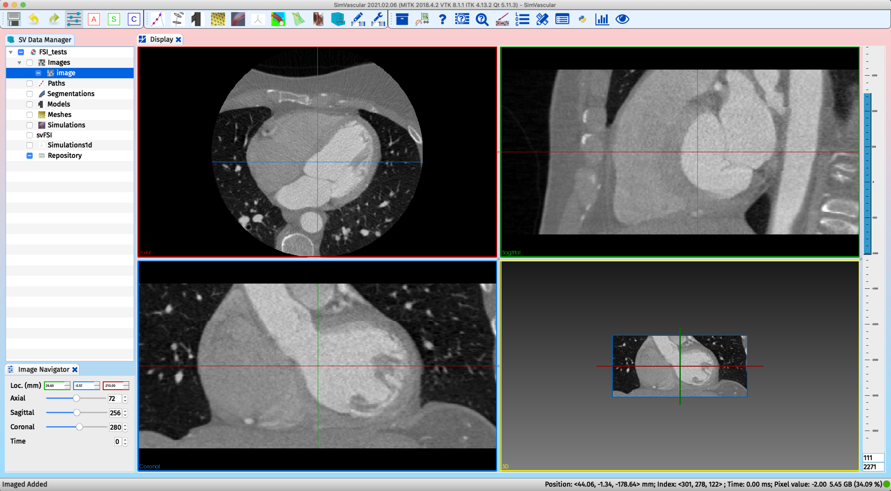
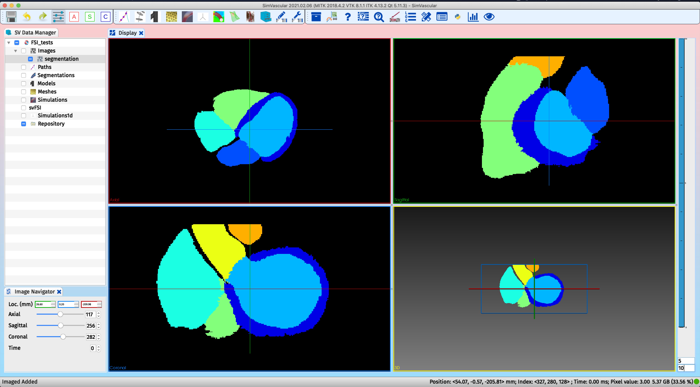

# Automatic Machine Learning Cardiac Segmentation

## Introduction 

The SimVascular **Automatic Cardiac Segmentation Tool** uses pre-trained deep neural network models to automaticall generate segmentations for major cardiac structures, the four heart chambers, aorta and pulmonary arteries. The automatic cardiac segmentation tool utilized an ensemble of two-dimensional (2D) convolutional neural networks (CNNs) for automatic segmentation of cardiac structures from three-dimensional (3D) patient images and demonstrated state-of-the-art performance than prior approaches when evaluated on a benchmark dataset containing both magnetic resonance (MR) and computed tomogra- phy(CT) cardiac scans. This tool can be used from both the SimVascular's Python plugin in the GUI or from the command line version of the SimVascular Python. Detailed description about this tool can be found in the following paper:

Kong, F., and Shadden, S. C. (August 7, 2020). "Automating Model Generation for Imagebased Cardiac Flow Simulation." ASME. J Biomech Eng. doi: https://doi.org/10.1115/1.4048032

## Input Requirements
The preferred input format of the image volumes is **.nii.gz or .nii or .vti**. VTK image volumes (.vti) should be reoriented to have an orientation matrix of identity. This is because the segmnetation method requires identity-oriented image volumes while the version of VTK within SimVascular does not include orientation matrix with VTI images.
The directory containing the input image data should be organized as follows:

```
image_dir
     |__ patient_id (optional)
         |__ image_volume0.vti
         |__ image_volume1.vti
         |__ image_volume2.vti
         |__ ...
```
## Download  Pre-Trained Models
We used the image and ground truth data provided by [MMWHS](https://zmiclab.github.io/projects/mmwhs/) to train our models. 
Our segmentation models were trained simultaneously on CT and MR data and trained weights are [here](https://drive.google.com/open?id=162Xr5OezSZL-0K3aoYO7WnHWuGTEXkkj). 

## Predict Segmentations From Image Data

### Prediction Using SimVascular Python Shell

To generate segmentations for 3D CT or MR image volumes, we can use SimVascular's Python Shell to run the prediction script. The SimVascular Python Shell can be invoked from the terminal according to the following instruction: http://simvascular.github.io/docsPythonInterface.html#python_shell. The prediction script `prediction.py` can be found here in SimVascular's source code: Python/site-packages/sv_auto_lv_modeling/segmentation/prediction.py

```bash
data_path=/path/to/data
sv_python_dir=/usr/local/bin
script_dir=SimVascular/Python/site-packages/sv_auto_lv_modeling

patient_id=WS01
image_dir=$data_path/01-Images
output_dir=$data_path/02-Segmnts
weight_dir=$data_path/Weights

${sv_python_dir}/simvascular --python -- $script_dir/segmentation/prediction.py \
    --pid $patient_id \
    --image $image_dir \
    --output $output_dir \
    --model $weight_dir \
    --view  0 1 2 \ # 0 for axial, 1 for coronal, 2 for sagital
    --modality ct # ct or mr
```
A shell script (`Python/site-packages/sv_auto_lv_modeling/segmentation.sh`) is provided for ease of use. 

### Prediction Using SimVascular Python Console

We can also use the Python console in SimVascular GUI to run the prediction script. Within the Python plugin, we can use the **Text Editor** mode and enter the following lines to create a Python script. 

```Python
from auto_lv.auto_lv import Segmentation
data_path='/path/to/data'
seg = Segmentation()
seg.set_modality('ct')
seg.set_patient_id ('WS01')
seg.set_image_directory (data_path+'/01-Images')
seg.set_output_directory (data_path+'/02-Segmnts')
seg.set_model_directory ([data_path+'/Weights'])
seg.set_view ([2])
seg.generate_segmentation()
```

## Visualize Segmentation Results

We can use either SimVascular or Paraview (for .vti files) to visualize the segmentation results. In SimVascular, we can right-click **Images** and chose **Add/Replace Image** to visualize the image and the segmentation data. The following two pictures show an example of CT image and the segmentaion results. 


