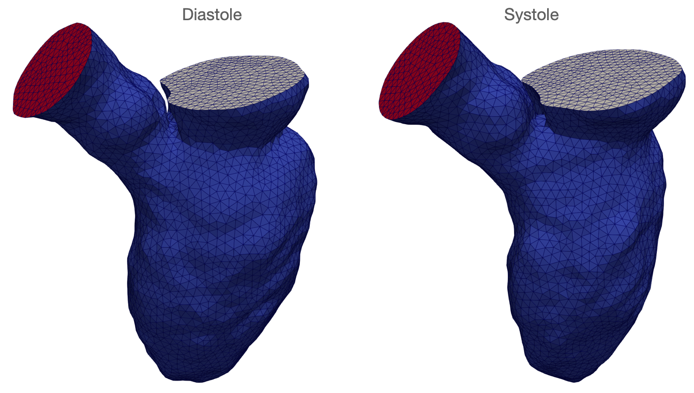

# Automatic LV Mesh Generation For Cardiac Flow Simulations in svFSI

## Introduction

One application of the **SimVascular Automatic Cardiac Segmentation** tool is to generate left venticle (LV) meshes from the segmentation results. We can use these meshes to perform computational fluid dynamics (CFD) modeling of LV flow combined with patient medical imaging data.  A typical LV model construction pipeline usually starts with segmentation of the LV by manual delineation followed by mesh generation and registration techniques using separate software tools. In SimVascular, we have included an **Automatic LV Mesh Generation** tool to automate each of these steps to generate simulation-ready meshes with no or few human efforts. 

The  **Automatic LV Mesh Generation** tool takes in the generated segmentation and output reconstructed LV surface meshes for CFD simulations. Besides we also provide Python scripts for registering the surface meshes to compute wall motion using [SimpleElastix](https://simpleelastix.github.io/). These registered surface meshes can also be interpolated to obtain sufficient temporal resolution.

## Construct LV Surface Meshes with Tagged Boundary Faces

### Using SimVascular Python Shell

* Similarly, we can use SimVascular's Python Shell to run the prediction script. The SimVascular Python Shell can be invoked from the terminal according to the following instruction: http://simvascular.github.io/docsPythonInterface.html#python_shell. The surface generation script `surface_main.py` can be found here in SimVascular's source code: Python/site-packages/sv_auto_lv_modeling/modeling/surface_main.py

    ```bash
    # Path to SimVascular exectuable
    data_path=/path/to/data
    sv_python_dir=/usr/local/bin
    script_dir=SimVascular/Python/site-packages/sv_auto_lv_modeling
    
    # Path to the segmentation results
    p_id=WS01
    input_dir=$data_path/02-Segmnts/$p_id
    # Path to the outputed surface meshes
    output_dir=$data_path/03-Surfaces/$p_id
    
    model_script=$script_dir/modeling/surface_main.py
    # Construct LV surface meshes with tagged boundary faces
    ${sv_python_dir}/simvascular --python \
            -- ${model_script} \
            --input_dir ${input_dir} \
            --output_dir ${output_dir} \
            --edge_size 3.5 # maximum edge size for the mesh
    ```

### Using SimVascular Python Console

* We can also use the Python console in SimVascular GUI to run the prediction script. Within the Python plugin, we can use the **Text Editor** mode and enter the following lines to create a Python script. 

  ```python
  from auto_lv.auto_lv import Modeling
  data_path='/path/to/data'
  surf = Modeling()
  surf.set_segmentation_directory(data_path+'/02-Segmnts/WS01')
  surf.set_output_directory (data_path+'/03-Surfaces/WS01')
  surf.set_max_edge_size (3.5)
  surf.generate_lv_modes ()
  ```



## Volumetric Meshing using SimVascular 

### Using SimVascular Python Shell

The volumetric meshing script `volume_mesh_main.py` can be found here in SimVascular's source code: Python/site-packages/sv_auto_lv_modeling/modeling/volume_mesh_main.py

```bash
data_path=/path/to/data
sv_python_dir=/usr/local/bin
script_dir=SimVascular/Python/site-packages/sv_auto_lv_modeling

p_id=WS01
# Path to the surface meshes
input_dir=$data_path/04-SurfReg/$p_id
# Path to the outputed volume meshes
output_dir=$data_path/05-VolMesh/$p_id
volume_mesh_script=$script_dir/modeling/volume_mesh_main.py

# Volumetric Meshing using SimVascular
${sv_python_dir}/simvascular --python \
    -- ${volume_mesh_script} \
    --input_dir $input_dir \
    --output_dir $output_dir \
    --phase 0 \ # the phase id in $input_dir to generate a volumetric mesh
    --edge_size 3.5
```

### Using SimVascular Python Console

Within the Python plugin, we can use the **Text Editor** mode and enter the following lines to create a Python script. 

```python
from auto_lv.auto_lv import VolumeMesh
data_path='/path/to/data'
vol = VolumeMesh()
vol.set_output_directory (data_path+'/05-VolMesh/WS01')
vol.set_max_edge_size (3.5)
vol.set_surface_model_filename (data_path+'/04-SurfReg/WS01/WS01_0.vti.vtp')
vol.generate_volume_mesh()
```

## Construct Point Corresponded LV Meshes from 4D Images

We can simulate the LV flow over time by tracking the deformation of the heart from time-resolved imaging and imposes this motion to the fluidic domains inside the heart, which leads to a deforming-domain CFD problem. To be able to track the deformation of the generated LV mesh over time, we need to building point-corresponded LV meshes from segmentations at all time frames. We generate a surface mesh at one time frame and propagated to the others using the displacement field obtained from registering the corresponding segmentations.

We will need [SimpleElastix](https://github.com/SuperElastix/SimpleElastix) to perform the registration. One commit that is compatible with our code is  8244e0001f4137514b0f545f1e846910b3dd7769. The registration script `elastix_main.py` can be found here in SimVascular's source code: Python/site-packages/sv_auto_lv_modeling/modeling/elastix_main.py

```bash
# Use SimpleElastix to register surface meshes

data_path=/path/to/data
sv_python_dir=/usr/local/bin
script_dir=SimVascular/Python/site-packages/sv_auto_lv_modeling

# Path to the ct/mr images or segmentation results
p_id=WS01
image_dir=$data_path/01-Images/$p_id
mask_dir=$data_path/02-Segmnts/$p_id
# Path to the unregistered surface mesh
surface_dir=$data_path/03-Surfaces/$p_id
# Path to the registered surface meshes
output_dir=$data_path/04-SurfReg/$p_id

# Phase ID of the surface mesh used as the registration source
start_phase=0

# Registration with SimpleElastix
python $script_dir/modeling/elastix_main.py \
    --image_dir $mask_dir \
    --mask_dir $mask_dir \
    --output_dir $output_dir \
    --start_phase $start_phase \
    --surface_dir $surface_dir \
    --image_file_extension vti \
    --edge_size 3.5
```


## Compute Mesh Motion from Registered Meshes

Once we have registered meshes, we can then compute the displacement on each mesh vertex over the whole cardiac cycle. As the temporal resolution of time-series image data is usually not high enough for CFD simulations, we can apply cublic spline interpolation to the registered meshes to obtain finer and smooth mesh displacements. We provide a Python script to interpolate the meshes,  compute the mesh motion, and write out a  `.dat` file for each boundary face that can used in svFSI to set up the displacement boundary conditions. The interpolation script `interpolation.py` can be found here in SimVascular's source code: Python/site-packages/sv_auto_lv_modeling/modeling/svfsi/interpolation.py. 

```shell
# Generate motion.dat File for svFSI
                                                                                            
data_path=/path/to/data
sv_python_dir=/usr/local/bin
script_dir=SimVascular/Python/site-packages/sv_auto_lv_modeling

# Phase ID should be the same as the one used in volume_mesh.sh
phase_id=0
p_id=WS01

# Path to the registered surface meshes
input_dir=$data_path/04-SurfReg/$p_id
# Path to the outputed volumetric meshes
output_dir=$data_path/05-VolMesh/$p_id
# Number of interpolations between adjacent phases
num=99
# Number of cardiac cycles
cyc=1
# Cycle duriation in seconds
period=1.25

# Write boundary conditions for FSI simulations
python $script_dir/modeling/svfsi/interpolation.py \
    --input_dir $input_dir \
    --output_dir $output_dir \
    --num_interpolation $num \
    --num_cycle $cyc \
    --duration $period \
    --phase $phase_id
```


